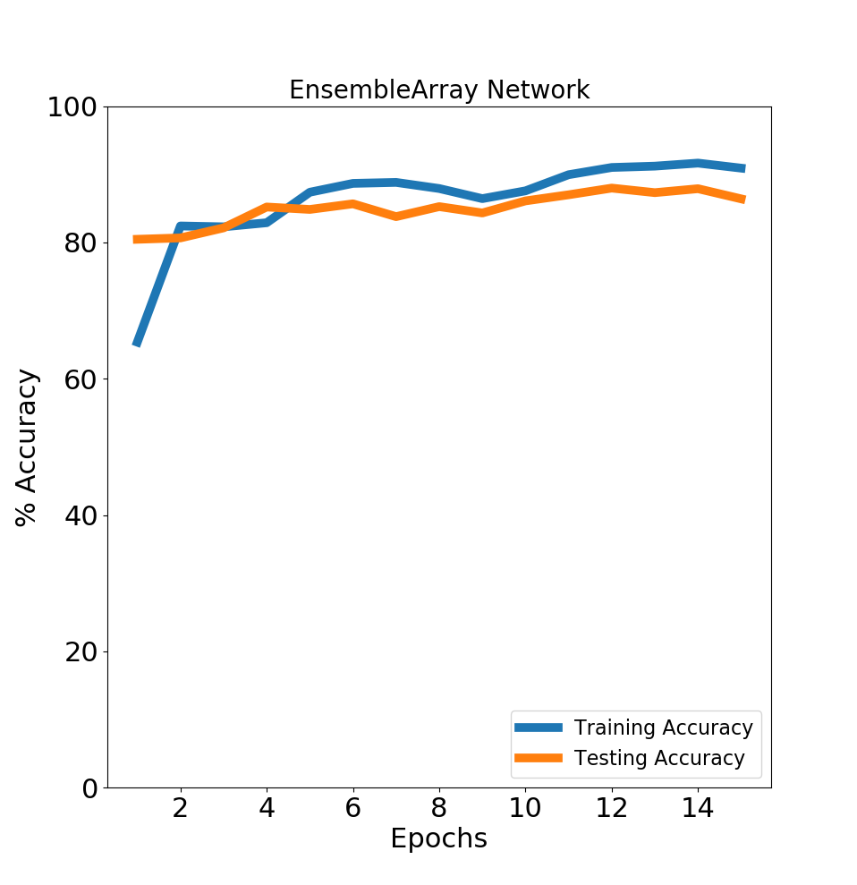
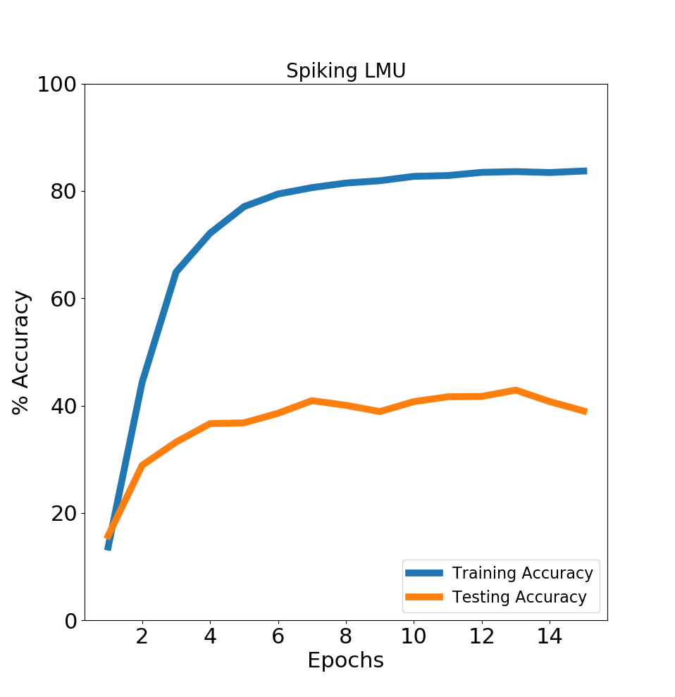
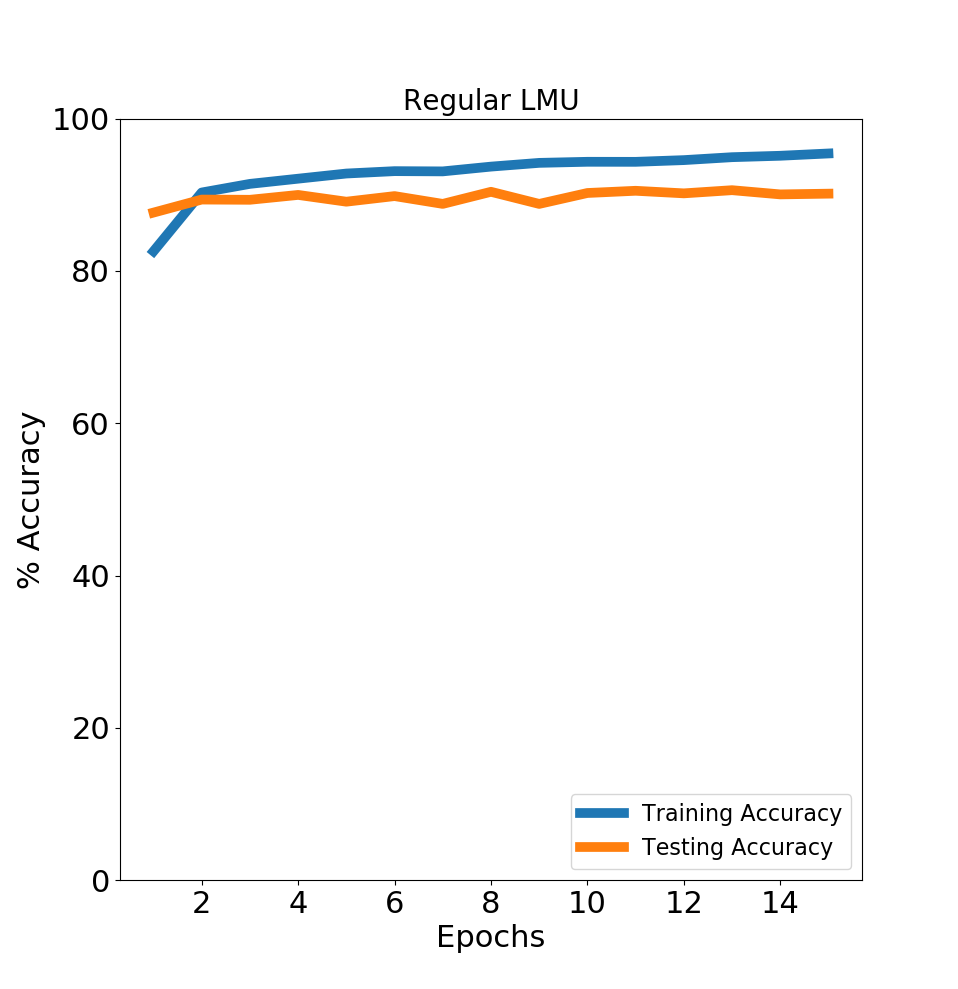

# SNN Action Recognition

# Intro

This repository contains results for applying a Convolutional Neural Network (CNN) and a Spiking Neural Network (SNN) for learning action recognition on the UCF101 action data set. This code takes advantage of the PyTorch framework for the CNN and the SNN uses Nengo_dl which incorporates deep learning into Nengo, a python library for simulating neural models.

# Installation and Usage
To install all of the libraries to run the code in this repository, do the following.

```
pip install -r requirements.txt
```

I HIGHLY recommend using a machine with a GPU when running this code. Doing so made the software run about 20 times as fast (with an AMD Ryzen Threadripper 2970WX 24-Core Processor CPU vs a GTX 2080).

Also available is the data forward passed through the trained CNN. This and the pretrained weights for the CNN for this experiment are given [here](https://drive.google.com/file/d/1LiPBLh0DCQ33Z0730yZ1sRoqlM3h9EFN/view?usp=sharing). Please cite the creators of [UCF101](https://www.crcv.ucf.edu/data/UCF101.php) and [the pretrained weights](https://github.com/HHTseng/video-classification) respectively if you use their data.

To run the code, please do the following  
```
python main.py -c path/to/config.json
```
Alternatively running
```
python main.py
```
will use the path "./configs/config.json" as the default.

## Config.json
name: Name of project, used in naming directories where the logs are saved.  
seed: Seed # for this project.  
data_path: Location where the RAW data is (if you want to forward pass the data through the CNN).  
use_cuda: Do you want to use your GPU?  
save_dir: Location where logs are saved  

dataloader: Anything related to how the raw data becomes forward passed through the CNN and given to the SNN.  
shuffle: Will the data be given to the CNN in a random order?  
pin_memory: IDK but Im too scared to change it :)  
batch_size: Batch size for forward passing data through the CNN  

pickle_locations: Locations of various pickled data that may be useful for saving you time instead of gathering the data yourself.  

SNN-minibatch_size: minibatch size for training/testing the SNN  

SNN_trainer: Settings that related to training/testing the SNN  
epochs: Number of epochs to TRAIN for  
import_CNN_forward_data: Where data that was passed through the CNN and pickled loaded in. If false will forward pass and save the data to the pickled locations.  
get_initial_testing_accuracy: Whether the untrained SNN should forward pass the data (mostly used as a sanity check)  
do_SNN_training: Whether the SNN is trained or not. If false will load in the SNN weights.  


# Architecture

The CNN architecture is RESNET-152. The CNN used pretrained weights acquired from [this repository](https://github.com/HHTseng/video-classification). This CNN was trained on the same data set, but also used a LSTM during training to learn temporal features.

Two architectures were chosen for the SNN. The first is an "EnsembleArray". An ensemble is a group of neurons that collectively represent a vector. The EnsembleArray class creates an array of these Ensembles that are connected together layer by layer.
The second architecture chosen was the use of a LMU, spiking and non spiking. More information about the LMU can be found in their paper [here](http://papers.nips.cc/paper/9689-legendre-memory-units-continuous-time-representation-in-recurrent-neural-networks).

# Nengo_dl

Documentation for nengo and nengo_dl can be found on their [website](https://www.nengo.ai/) and in their respective papers. [nengo](https://www.frontiersin.org/articles/10.3389/fninf.2013.00048) [nengo_dl](https://link.springer.com/article/10.1007/s12021-019-09424-z)

# UCF101

This data set was acquired from labeling and cutting YouTube videos into clips that range from 30 frames to a few minutes. There are 101 possible actions that each video can be labeled. This raw, split data set can be downloaded [here](https://drive.google.com/open?id=1j0EKt_DeyDfyrk0HjAhSTurMdeoO8KWL).

# Results
Since the UCF101 data set has clips from the same videos, it is useful to use the data set splits that are given. In the following results split 1 is used.

All of the models converged to their top accuracy fairly quickly, and further training typically led to overfitting. All of the models used a SpikingRectifiedLinear type model for the neuron as this trained quickly and led to the best results. LIF was also tested and trained quickly but performed worst. Finally, AdaptiveLIFRate and Izhikevich neuron models were attempted, but trained extremely slower compared to LIF and SpikingRectifiedLinear. Documentation about these neurons can be found [here](https://www.nengo.ai/nengo/_modules/nengo/neurons.html).

## EnsembleArray
The best testing accuracy achieved with the EnsembleArray architecture was 87.98%. It was noticed that as the n_ensembles increased, the better performance became. This wasn't as noticeable for n_neurons. This results was achieved with n_neurons = 50 and n_ensembles = 10,000.



## LMU
The best results were typically obtained when the order of the LMU was 2, and the number of units would need to fine tuned to find the best results (In this case I kept both at 800). For the spiking LMU the best results were 42.89% while the non-spiking LMU had a best accuracy of 90.61%.

From observations, it seemed that the spiking LMU was more prone to overfitting than the non-spiking version. I was not able to rectify this issue.

## Analysis
In the GitHub project that the CNN is used from, the author managed to get an accuracy of 85.68% as the best results when using the same CNN + LSTM. This accuracy is also inflated by the fact that the author had some of their training data leak into their testing data [(see issue here)](https://github.com/HHTseng/video-classification/issues/20). Therefore, by using a non-spiking LMU or the EnsembleArray instead of a LSTM results in better accuracy. It should be noted that the best accuracy on this data set is around 95.6% according to [this paper](https://www.sciencedirect.com/science/article/pii/S0923596518304922).





Extensions:
-Artificially increase the length of the videos or cut the longer videos into smaller segments for more training data. Currently only the first 30 frames of each video are used.  
-End to End training of the CNN + SNN together.  
-Anything else in the issues page  
